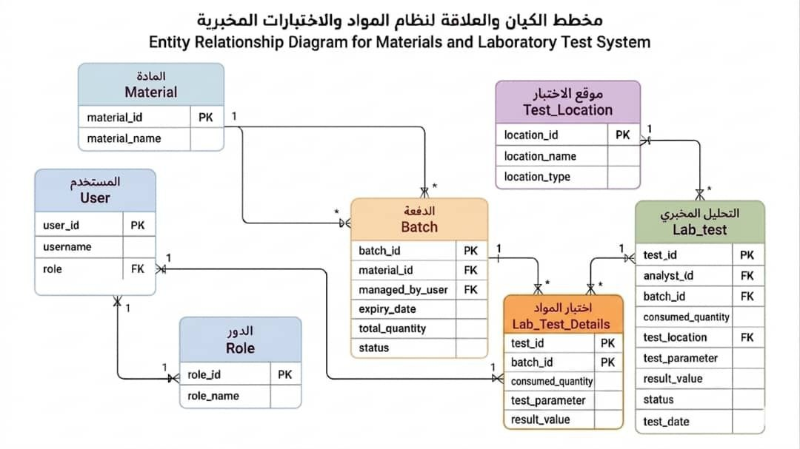
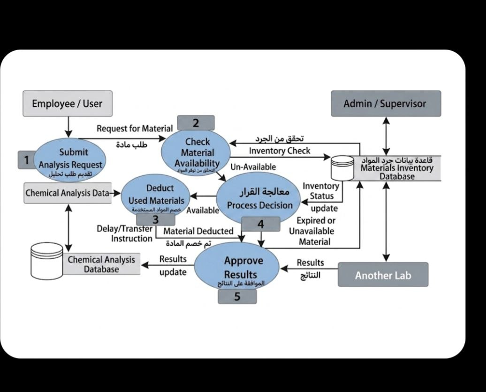
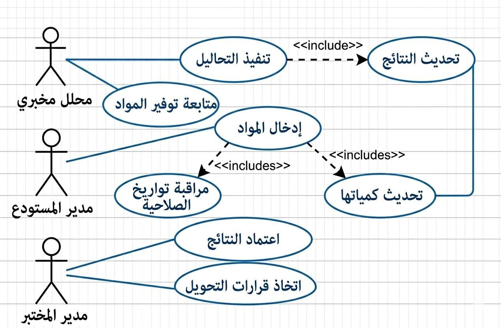
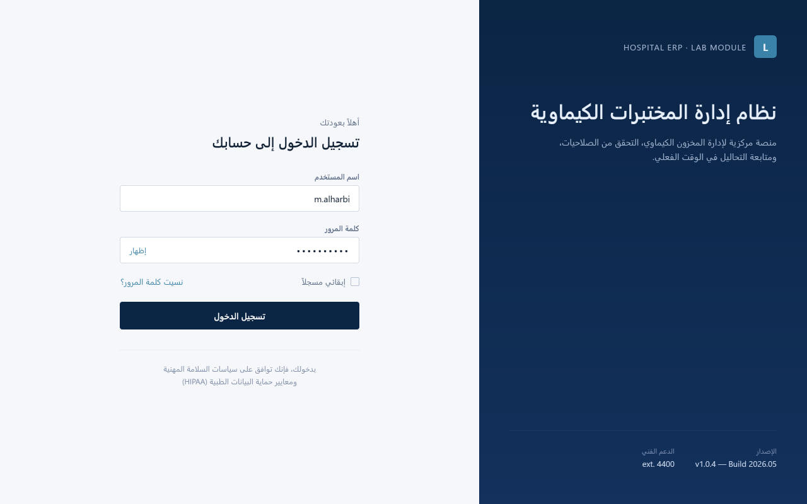
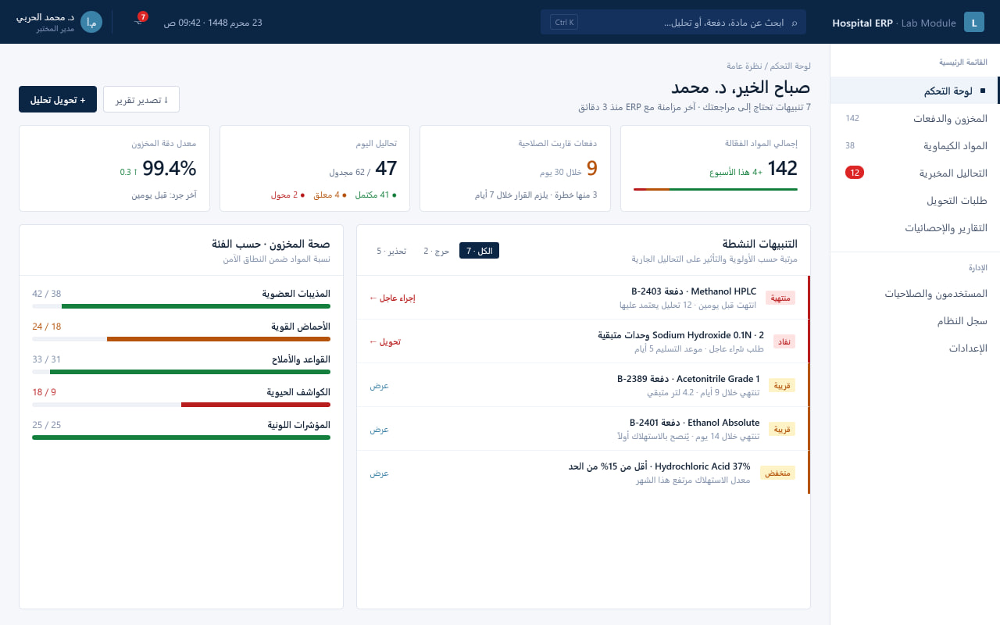
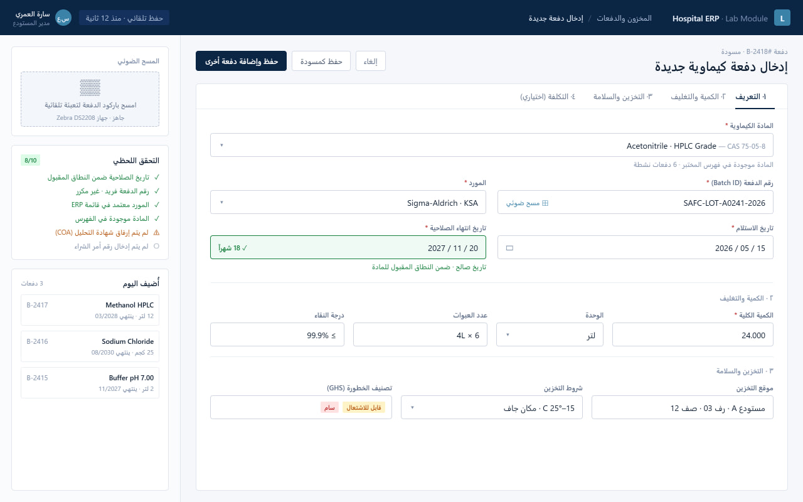

# Software Requirements Specification (SRS)

## Project: نظام تخطيط موارد المؤسسة (ERP) للمستشفيات
## Module/Subsystem: نظام إدارة المختبرات الكيماوية
**Version:** 1.0  
**Date:** 2026-05-12

---

## 1. Introduction
### 1.1 Purpose
تهدف هذه الوثيقة إلى تحديد المتطلبات البرمجية لموديول **نظام إدارة المختبرات الكيماوية**، والذي يعتبر جزءاً لا يتجزأ من نظام تخطيط موارد المؤسسة (ERP) الأكبر. الغرض الأساسي هو ربط إجراء التحاليل بتوفر المواد الأولية وصلاحيتها، لضمان دقة النتائج وكفاءة إدارة المخزون. تستهدف هذه الوثيقة فرق التطوير، الاختبار، وإدارة المشروع لضمان فهم مشترك للمتطلبات.

### 1.2 Scope
يختص هذا النظام بإدارة العمليات داخل المختبرات الكيميائية والطبية التي تعتمد على المواد الكيميائية في تنفيذ التحاليل. 
*   **ما سيفعله النظام:**
    *   إدارة وتتبع المخزون من المواد الكيماوية والدفعات (Batches).
    *   التحقق اللحظي من صلاحية وتوفر المواد قبل بدء التحاليل.
    *   خصم الكميات المستهلكة تلقائياً من المخزون بعد انتهاء التحاليل.
    *   توفير تنبيهات حول انتهاء صلاحية المواد الكيماوية.
    *   دعم التكامل مع نظام الـ ERP الأب لمزامنة بيانات المستودع والتكاليف.
    *   دعم واجهات المستخدم لأدوار المحلل المخبري، مدير المستودع، ومدير المختبر.
*   **ما لن يفعله النظام:**
    *   لن يقوم بإدارة الجوانب المحاسبية الكاملة للمؤسسة (فهذه مسؤولية نظام الـ ERP).
    *   لن يقوم بإدارة الموارد البشرية أو كشوف المرتبات.
    *   لن يوفر وظائف إدارة المرضى أو السجلات الطبية الإلكترونية (EMR) بشكل مباشر.

### 1.3 Definitions, Acronyms, and Abbreviations
| المصطلح | التعريف |
| :------ | :------- |
| **SRS** | Software Requirements Specification - وثيقة مواصفات متطلبات البرمجيات. |
| **ERP** | Enterprise Resource Planning - نظام تخطيط موارد المؤسسة (النظام الأب الذي يتبعه المختبر). |
| **Batch** | "الدُفعة" - كمية محددة من المادة الكيماوية يتم شراؤها معاً ولها تاريخ صلاحية واحد. |
| **ERD** | Entity Relationship Diagram - مخطط يوضح جداول قاعدة البيانات والعلاقات بينها. |
| **Actor** | "الممثل" - أي شخص أو نظام خارجي يتفاعل مع نظام المختبر (مثل المحلل أو المدير). |
| **DSS** | Decision Support System - نظام دعم القرار الذي يساعد المدير في اتخاذ قرار (التحويل أو التأجيل). |
| **API** | Application Programming Interface - واجهة برمجة التطبيقات لربط موديول المختبر مع الأنظمة الأخرى. |

### 1.4 References
*   معيار IEEE 830-1998: الممارسة الموصى بها لمواصفات متطلبات البرمجيات.
*   وثيقة تكامل النظام (System Integration Document): الاتفاقيات المبرمجة مع فريق الـ ERP لضمان توافق البيانات.
*   دليل إدارة المختبرات القياسي: لضمان مطابقة النظام لقواعد السلامة والصلاحية الكيماوية.
*   مستودع GitHub الخاص بالمشروع.

### 1.5 Overview
تتكون هذه الوثيقة من أربعة أقسام رئيسية. يقدم القسم الأول (المقدمة) نظرة عامة على الغرض والنطاق والتعريفات والمراجع. يصف القسم الثاني (الوصف العام) منظور المنتج، واجهاته المختلفة، ووظائفه الرئيسية، وخصائص المستخدمين، والقيود العامة. يتناول القسم الثالث (المتطلبات المحددة) المتطلبات الوظيفية في شكل قصص مستخدمين، بالإضافة إلى متطلبات الأداء وقاعدة البيانات وسمات النظام. أخيراً، يحتوي القسم الرابع (الملاحق) على أي مخططات أو وثائق داعمة. 

---

## 2. Overall Description
### 2.1 Product Perspective
يعتبر موديول **جودة وتخزين المواد الكيماوية** المكون الأساسي لضمان سلامة العمليات المخبرية ضمن نظام الـ ERP الأكبر. لا يعمل النظام كأداة تسجيل فقط، بل كمنظومة رقابية تربط بين توفر المخزون وبين صلاحية التنفيذ. وظيفته الأساسية هي التحقق من جودة المواد قبل استهلاكها في أي تحليل، وضمان التحديث اللحظي للكميات. يتفاعل هذا الموديول بشكل وثيق مع قاعدة البيانات الرئيسية لنظام الـ ERP ومع موديولات أخرى مثل المحاسبة والمشتريات.

*   **2.1.1 System Interfaces:**
    *   **التكامل مع نظام الـ ERP:** توفير واجهة برمجية (API) لربط بيانات المستودع مع النظام المحاسبي العام للمؤسسة لضمان مزامنة التكاليف والكميات.
    *   **التواصل مع قاعدة البيانات:** واجهة الربط بين التطبيق وقاعدة بيانات SQL Server لإدارة عمليات الاستعلام والتخزين.

*   **2.1.2 User Interfaces:**
    سيتم تطوير نماذج أولية للشاشات (Screen Prototypes) وتقديم مخططات مرئية (Mockups) لكل من:
    *   شاشة تسجيل الدخول الموحدة لجميع الأدوار.
    *   لوحة تحكم مدير المختبر (إحصائيات وتنبيهات).
    *   نموذج إدخال دفعات المواد (Batch Entry Form) مع حقول التواريخ والكميات.
    *   قائمة الفحص (Checklist) للمحلل المخبري لاختيار المواد قبل التحليل.
    *   **صيغ الرسائل والإشعارات:**
        *   رسائل النجاح: "تم خصم الكميات وتحديث المخزون بنجاح" عند انتهاء التحليل.
        *   رسائل التحذير: "تنبيه: المادة [اسم المادة] قريبة من انتهاء الصلاحية".
        *   رسائل الخطأ: "عذراً، لا يمكن بدء التحليل؛ المادة [اسم المادة] منتهية الصلاحية."

*   **2.1.3 Hardware Interfaces:**
    *   يدعم التوافق مع أجهزة قراءة الباركود (Barcode Scanners) لتسريع عملية جرد وإدخال المواد الكيماوية.
    *   يدعم النظام العمل على أجهزة الكمبيوتر المكتبية والمحمولة (Laptops) لموظفي المختبر والمستودع.

*   **2.1.4 Software Interfaces:**
    *   **نظام التشغيل:** يتوافق النظام مع المتصفحات الحديثة (Chrome, Edge, Firefox) على بيئة Windows.
    *   **قاعدة البيانات:** التفاعل مع قاعدة بيانات SQL Server لتخزين واسترجاع بيانات المواد والتحاليل.
    *   **التكامل مع ERP:** واجهة برمجية لربط بيانات المستودع مع النظام المحاسبي العام للمؤسسة.

*   **2.1.5 Communications Interfaces:**
    *   بروتوكول HTTP/HTTPS لتأمين نقل البيانات بين المتصفح والخادم.
    *   خدمة البريد الإلكتروني (SMTP) لإرسال تقارير دورية لمدير المختبر عن حالة المخزون.

*   **2.1.6 Memory & Operational Constraints:**
    *   **ذاكرة النظام (RAM):** يجب أن يعمل النظام بكفاءة على أجهزة لا تقل ذاكرتها العشوائية (RAM) عن 4GB (لضمان سرعة تحميل المتصفح وقاعدة البيانات).
    *   **التخزين (Storage):** يجب توفير مساحة تخزين لا تقل عن 10GB بشكل مبدئي على السيرفر لتخزين سجلات التحاليل وبيانات الدفعات (Batches).
    *   **العمليات المتزامنة (Concurrency):** يجب أن يدعم النظام عمل 20 مستخدم في نفس اللحظة (محللين ومدراء) دون التأثير على سرعة الاستجابة.
    *   **التوافر (Availability):** يجب أن يعمل النظام بنسبة 99% خلال ساعات دوام المختبر الرسمية، مع جدولة عمليات النسخ الاحتياطي (Backup) في ساعات خارج الذروة.

### 2.2 Product Functions
فيما يلي ملخص للوظائف الرئيسية التي سيقدمها نظام إدارة المختبرات الكيماوية:
*   إدارة وتحديث بيانات المخزون والدفعات (Batches) من المواد الكيماوية.
*   التحقق اللحظي من توفر وصلاحية المواد الكيماوية قبل بدء أي تحليل.
*   الخصم التلقائي للكميات المستهلكة من المخزون عند تسجيل نتائج التحاليل.
*   توفير آليات للتنبيه عند اقتراب انتهاء صلاحية المواد الخطرة.
*   دعم عملية تحويل التحاليل إلى مختبرات أخرى في حال نقص المواد.

### 2.3 User Characteristics
يستهدف النظام الفئات التالية من المستخدمين، مع مستويات مختلفة من الصلاحيات والخبرة التقنية:
*   **محلل مخبري:** يقوم بتنفيذ التحاليل، تسجيل النتائج، ومتابعة توفر المواد. يُفترض أن لديه تدريب أساسي على استخدام المتصفحات وأجهزة قراءة الباركود.
*   **مدير المستودع:** مسؤول عن إدخال المواد الجديدة، تحديث كمياتها، ومراقبة تواريخ الصلاحية. يُفترض أن لديه تدريب أساسي على استخدام المتصفحات وأجهزة قراءة الباركود.
*   **مدير المختبر:** يمتلك صلاحية اعتماد النتائج، اتخاذ القرارات الإدارية، ومراقبة التقارير والإحصائيات. يُفترض أن لديه خبرة جيدة في استخدام الأنظمة الحاسوبية.

### 2.4 Constraints, Assumptions, and Dependencies
#### 2.4.1 القيود (Constraints)
*   **الأمن والخصوصية:** يجب تشفير كلمات مرور المستخدمين. لا يجوز للمحلل المخبري الوصول إلى سجلات المشتريات أو تعديل كميات المستودع يدوياً.
*   **قوانين البيانات:** يجب أن يتوافق النظام مع معايير السلامة المهنية، بما في ذلك التنبيه عند اقتراب انتهاء صلاحية المواد الكيماوية الخطرة.
*   **لغة النظام:** الواجهات ستكون باللغة العربية/الإنجليزية، مع دعم كامل للترميز العالمي UTF-8.

#### 2.4.2 الافتراضات (Assumptions)
*   يُفترض أن جميع المستخدمين لديهم تدريب أساسي على استخدام المتصفحات وأجهزة قراءة الباركود.
*   يُفترض وجود اتصال دائم ومستقر بشبكة الإنترنت/الشبكة الداخلية للوصول إلى قاعدة بيانات الـ ERP المركزية.

#### 2.4.3 الارتباطات (Dependencies)
*   يعتمد النظام بشكل كلي على فريق التكامل (Integration Team) لتزويدنا بـ API خاص ببيانات الموظفين وصلاحياتهم.
*   يعتمد بدء العمل على واجهة النتائج على استلام "قائمة المواد الكيماوية" النهائية من قسم المشتريات.

---

## 3. Specific Requirements (Agile Approach)
هذا القسم يترجم المتطلبات الوظيفية التقليدية إلى قصص مستخدمين (User Stories) ضمن منهجية Agile، مع إمكانية ربطها بمهام في نظام إدارة المشاريع (مثل GitHub Issues).

### 3.1 External Interface Requirements
*   **واجهة برمجة تطبيقات (API) لنظام ERP:**
    *   **الغرض:** مزامنة بيانات المخزون، التكاليف، وكميات المواد الكيماوية مع النظام المحاسبي العام للمؤسسة.
    *   **نقطة النهاية (Endpoint):** سيتم تحديدها بالتعاون مع فريق التكامل (Integration Team).
    *   **طريقة الاتصال:** RESTful API عبر بروتوكول HTTPS.
    *   **تنسيق البيانات:** JSON.
    *   **المصادقة:** OAuth 2.0 أو مفتاح API (سيتم تحديده لاحقاً).
*   **واجهة قاعدة بيانات SQL Server:**
    *   **الغرض:** إدارة عمليات الاستعلام والتخزين لبيانات المواد، الدفعات، والتحاليل.
    *   **الاتصال:** عبر ADO.NET أو JDBC (حسب لغة التطوير).
    *   **الاستعلامات:** استخدام T-SQL لضمان الكفاءة والأمان.

### 3.2 System Features & User Stories

#### 3.2.1 Feature: إدارة المخزون والدفعات
*   **Description:** تتيح هذه الميزة لمدير المستودع إدخال وتتبع المواد الكيماوية ودفعاتها، بما في ذلك تواريخ الصلاحية والكميات، لضمان دقة المخزون ومنع استخدام المواد منتهية الصلاحية.
*   **Priority:** High.
*   **User Stories:**
    *   **Story 1:** بصفتي مدير مستودع، أريد إدخال دفعات المواد الكيماوية الجديدة مع تاريخ صلاحيتها، لكي يمنع النظام استخدام المواد المنتهية الصلاحية ويحدث كمية المواد المتاحة.
        *   *Acceptance Criteria:* يجب أن يتمكن النظام من تسجيل دفعة جديدة بنجاح، وتخزين تاريخ الصلاحية والكمية. يجب أن يقوم النظام بتنبيه المستخدم إذا حاول إدخال تاريخ صلاحية سابق. يجب أن تظهر الدفعة في قائمة المخزون المتاحة.
        *   *GitHub Issue:* #LAB-001
    *   **Story 2:** بصفتي مدير مستودع، أريد تحديث كمية مادة كيماوية موجودة، لكي تعكس التغييرات في المخزون بدقة.
        *   *Acceptance Criteria:* يجب أن يتمكن النظام من تعديل الكمية المتاحة لدفعة معينة. يجب أن يتم تحديث المخزون الكلي للمادة تلقائياً.
        *   *GitHub Issue:* #LAB-002

#### 3.2.2 Feature: التحقق من صلاحية وتوفر المواد قبل التحليل
*   **Description:** تضمن هذه الميزة أن المحلل المخبري يستخدم فقط المواد الكيماوية الصالحة والمتوفرة، مما يقلل من الأخطاء ويزيد من موثوقية النتائج.
*   **Priority:** High.
*   **User Stories:**
    *   **Story 1:** بصفتي محلل مخبري، أريد التحقق من توفر وصلاحية المواد الكيماوية المطلوبة قبل بدء التحليل، لكي أتجنب استخدام مواد منتهية الصلاحية أو غير متوفرة.
        *   *Acceptance Criteria:* يجب أن يعرض النظام حالة توفر وصلاحية المادة فوراً عند اختيارها. يجب أن يمنع النظام بدء التحليل إذا كانت المادة غير متوفرة أو منتهية الصلاحية ويعرض رسالة خطأ واضحة.
        *   *GitHub Issue:* #LAB-003
    *   **Story 2:** بصفتي محلل مخبري، أريد أن يقوم النظام بخصم الكميات المستخدمة تلقائياً من المخزون عند تسجيل نتائج التحليل، لكي يتم تحديث المخزون بدقة وآنية.
        *   *Acceptance Criteria:* يجب أن يتم خصم الكمية المحددة من الدفعة الصحيحة بعد تسجيل النتائج بنجاح. يجب أن تظهر رسالة تأكيد بنجاح عملية الخصم وتحديث المخزون.
        *   *GitHub Issue:* #LAB-004

#### 3.2.3 Feature: دعم القرار لمدير المختبر
*   **Description:** توفر هذه الميزة لمدير المختبر الأدوات اللازمة لاتخاذ قرارات مستنيرة، مثل تحويل التحاليل عند نقص المواد، ومراقبة حالة المخزون.
*   **Priority:** Medium.
*   **User Stories:**
    *   **Story 1:** بصفتي مدير مختبر، أريد تحويل التحليل لمخبر آخر عند نقص المواد، لكي لا يتوقف العمل ويتم تقديم الخدمة للمرضى دون تأخير.
        *   *Acceptance Criteria:* يجب أن يوفر النظام واجهة لمدير المختبر لتحديد تحليل معين وتحويله إلى مختبر بديل. يجب أن يتم تسجيل عملية التحويل في سجلات النظام.
        *   *GitHub Issue:* #LAB-005
    *   **Story 2:** بصفتي مدير مختبر، أريد استلام تقارير دورية عبر البريد الإلكتروني عن حالة المخزون وتواريخ صلاحية المواد، لكي أتمكن من اتخاذ قرارات الشراء والتخطيط بفعالية.
        *   *Acceptance Criteria:* يجب أن يرسل النظام تقارير مخصصة (يومية/أسبوعية) إلى البريد الإلكتروني لمدير المختبر. يجب أن تتضمن التقارير معلومات عن المواد القريبة من انتهاء الصلاحية والمواد ذات المخزون المنخفض.
        *   *GitHub Issue:* #LAB-006

### 3.3 Performance Requirements
*   **سرعة الاستجابة:** يجب أن يتم خصم الكمية من المخزون فوراً (Real-time) عند تسجيل نتائج التحليل.
*   **سرعة البحث:** يجب ألا تستغرق عملية البحث عن مادة كيماوية في المخزون أكثر من ثانيتين.
*   **العمليات المتزامنة:** يجب أن يدعم النظام عمل 20 مستخدم في نفس اللحظة (محللين ومدراء) دون التأثير على سرعة الاستجابة.

### 3.4 Logical Database Requirements
سيعتمد النظام على قاعدة بيانات SQL Server، وستتضمن الجداول الرئيسية التالية:

| الجدول | الوصف | الحقول الرئيسية (أمثلة) |
| :------ | :---- | :--------------------- |
| **Users** | لتخزين معلومات المستخدمين وصلاحياتهم. | UserID (PK), Username, Password (مشفر), RoleID |
| **Materials** | لتخزين معلومات المواد الكيماوية العامة. | MaterialID (PK), MaterialName, UnitOfMeasure |
| **Batches** | لتخزين تفاصيل دفعات المواد الكيماوية. | BatchID (PK), MaterialID (FK), ExpiryDate, Quantity, Supplier |
| **LabTests** | لتخزين معلومات التحاليل المخبرية. | TestID (PK), TestName, RequiredMaterials |

### 3.5 Software System Attributes
*   **Reliability (الموثوقية):**
    *   يجب على النظام منع استخدام مادة منتهية الصلاحية للتحليل بشكل قاطع.
    *   يجب أن يكون النظام متاحاً بنسبة 99% خلال ساعات دوام المختبر الرسمية.
*   **Security (الأمان):**
    *   يجب تشفير كلمات مرور المستخدمين باستخدام خوارزميات تشفير قوية.
    *   يجب تأمين نقل البيانات بين المتصفح والخادم باستخدام بروتوكول HTTPS.
*   **Maintainability (قابلية الصيانة):**
    *   يجب كتابة الكود بشكل معياري (Modular) لتسهيل عملية التحديث والتطوير المستقبلي.

---

## 4. Appendices
### Appendix A: Glossary & Models

*   **مخطط علاقات الكيانات (ERD):**
    
    
*   **مخطط تدفق العمليات (Process Flow Diagram):**
    

*   **مخطط حالة الاستخدام (Use Case Diagram):**
    

*   **نماذج واجهات المستخدم (UI Mockups):**

### شاشة تسجيل الدخول

### لوحة تحكم مدير المختبر

### نموذج إدخال دفعات المواد

### Appendix B: GitHub Traceability Checklist
* [x] كل قصة مستخدم في القسم 3.2 لها مهمة (Issue) مقابلة في GitHub.
* [x] كل مهمة في GitHub لها تصنيف مناسب (مثل enhancement, requirement).
* [ ] طلبات السحب (Pull Requests) تشير إلى معرفات المهام (مثلاً، Closes #LAB-001).`Closes #LAB-001`).
